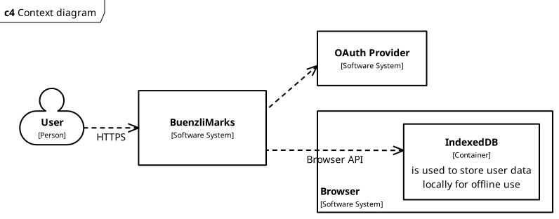

# System Scope and Context

BuenzliMarks is mostly a standalone application. Users interact with it through
their browser and HTTPS. BuenzliMarks uses the browser's indexedDB to cache user
data locally. Some OAuth provider is used for lightweight user authentication.

    </img>

