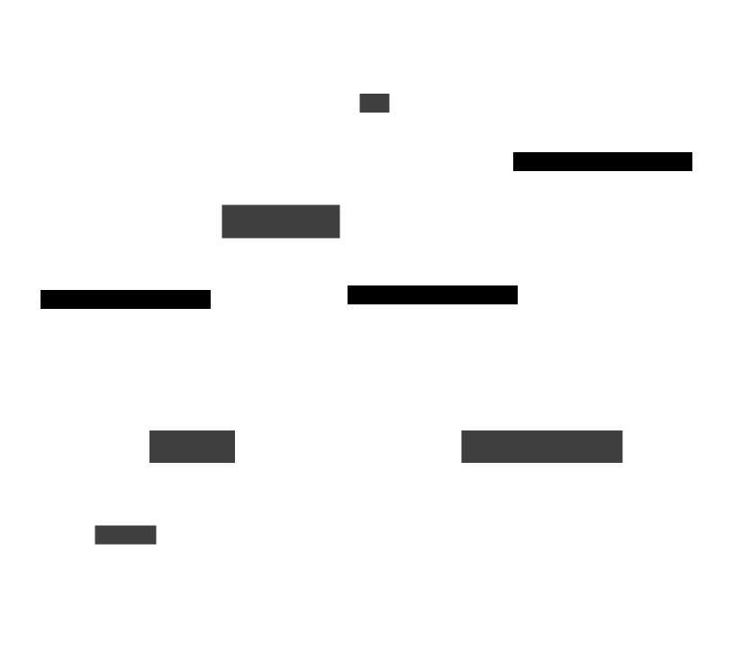

# System Scope and Context

buenzlimarks is mostly a standalone web application.
Users interact with it through their browser.
buenzlimarks uses the browser's IndexedDB to cache user data locally.
OAuth providers are used for lightweight user authentication.

